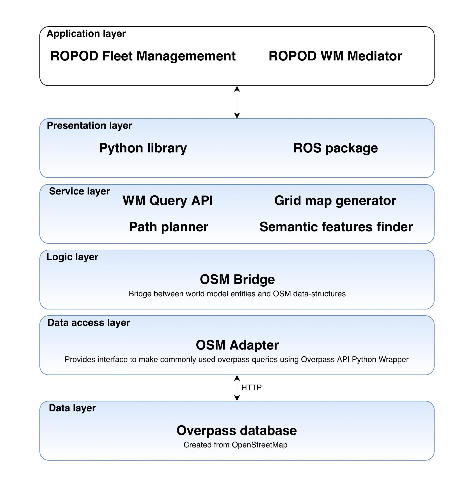

# OBL (OSM Bridge Library)

## Architecture



```
building (Building)
 |__ floors (Floor)
 |    |__ connections (Connection)
 |    |    |__ points (Point)
 |    |__ walls (Wall)
 |    |    |__ sides (Side)
 |    |    |    |__ corners (Point)
 |    |    |    |__ features (Feature)
 |    |    |__ geometry (Shape)
 |    |         |__ points (Point)
 |    |__ rooms (Room)
 |    |    |__ topology (Point)
 |    |    |__ geometry (Shape)
 |    |    |    |__ points (Point)
 |    |    |__ connections (Connection)
 |    |    |    |__ points (Point)
 |    |    |__ features (Feature)
 |    |    |__ walls (Wall)
 |    |    |    |__ geometry (Shape)
 |    |    |    |    |__ points (Point)
 |    |    |    |__ sides (Side)
 |    |    |         |__ corners (Point)
 |    |    |         |__ features (Feature)
 |    |    |__ local_areas (LocalArea)
 |    |    |    |__ topology (Point)
 |    |    |    |__ geometry (Shape)
 |    |    |         |__ points (Point)
 |    |    |__ doors (Door)
 |    |         |__ topology (Point)
 |    |         |__ geometry (Shape)
 |    |         |    |__ points (Point)
 |    |         |__ sides (Side)
 |    |              |__ corners (Point)
 |    |              |__ features (Feature)
 |    |__ corridors (Corridor)
 |         |__ <same as room>
 |__ elevators (Elevator)
 |    |__ <same as room>
 |__ stairs (Stairs)
 |    |__ <same as room>
 |__ geometry (Shape)
      |__ points (Point)
```

## Installation

For development installation of OBL clone & run the following command:
```
sudo pip3 install -e .
```

For production installation:
```
pip3 install git+git://github.com/ropod-project/osm_bridge.git
```

## Tests
To run all the tests:
```
python3 -m unittest discover -s 'tests' -p '*_test.py'
```

## Usage

### OSM Adapter

* Initialising OSMAdapter
```
OSMAdapter(server_ip=, server_port=):
- server_ip : overpass server ip
- server_port : overpass server port
```
* Testing connection to server
```
test_overpass_connection()
```
* Finding OSM elements based on their ids and data types
```
get_osm_element_by_id(ids, data_type, role, role_type): 
- ids : array containing OSM ids
- data_type : node/way/relation
- role : to query specific member of relation (optional)
- role_type : data type of relation member with specified role (optional)
```

* Searching OSM elements based on tags
```
search_by_tag(data_type, key, value, scope_id=, scope_role=, scope_role_type=):
- data_type : node/way/relation
- key : key to identify tag
- value : value of tag
- scope_id : reduces the search scope to specified relation members (optional)
- scope_role : relation member role where search should be performed (optional)
- scope_role_type : data type of relation member with specified role (optional)
```

* To make raw overpass queries
```
get(overpass_query_string):
overpass_query_string: raw overpass query string
```

### OSMBridge
Provides abstraction to world model (https://github.com/ropod-project/indoor_osm_robot_wm) using `OSMAdapter`

* Initialising OSMBridge
```
OSMBridge(server_ip=, server_port=, global_origin=, local_origin=, cooridnate_system=):
- server_ip : overpass server ip
- server_port : overpass server port
- global_origin : global origin in lat,lng ([lat,lng])
- local_origin : local origin in x,y ([x,y])
- coordinate_system : spherical / cartesian
```

* Selecting cooridnate system
```
set_cooridnate_system(name, global_origin=, local_origin=)
- name : cartesian/spherical
- local_origin : [lat, lon] required only if cartesian coordinate system is selected
```

* Finding features using semantic ref or OSM uuid
```
get_feature(ref) :
- ref : semantic ref (string) or OSM uuid (int)
```

* Finding door/wall sides using semantic ref or OSM uuid
```
get_side(ref) :
- ref : semantic ref (string) or OSM uuid (int)
```

* Finding door using semantic ref or OSM uuid
```
get_door(ref) :
- ref : semantic ref (string) or OSM uuid (int)
```

* Finding wall using semantic ref or OSM uuid
```
get_wall(ref) :
- ref : semantic ref (string) or OSM uuid (int)
```

* Finding local area using semantic ref or OSM uuid
```
get_local_area(ref) :
- ref : semantic ref (string) or OSM uuid (int)
```

* Finding connection using semantic ref or OSM uuid
```
get_connection(ref) :
- ref : semantic ref (string) or OSM uuid (int)
```

* Finding room using semantic ref or OSM uuid
```
get_room(ref) :
- ref : semantic ref (string) or OSM uuid (int)
```

* Finding corridor using semantic ref or OSM uuid
```
get_corridor(ref) :
- ref : semantic ref (string) or OSM uuid (int)
```

* Finding elevator using semantic ref or OSM uuid
```
get_elevator(ref) :
- ref : semantic ref (string) or OSM uuid (int)
```

* Finding stairs using semantic ref or OSM uuid
```
get_stairs(ref) :
- ref : semantic ref (string) or OSM uuid (int)
```

* Finding floor using semantic ref or OSM uuid
```
get_floor(ref) :
- ref : semantic ref (string) or OSM uuid (int)
```

* Finding building using semantic ref or OSM uuid
```
get_building(ref) :
- ref : semantic ref (string) or OSM uuid (int)
```

### PathPlanner
Provides A* based path planning functionality

* Setting desired building for path planning
```
set_building(building ref):
- ref : semantic ref (string) or OSM uuid (int)
```
* Setting coordinate system
```
set_coordinate_system('spherical'/'cartesian'):
```

* Getting path plan
```
get_path_plan(start_floor_ref, destination_floor_ref, start_area_ref, destination_area_ref):
- start_floor_ref : start floor semantic ref (string) or OSM uuid (int)
- destination_floor_ref : destination floor semantic ref (string) or OSM uuid (int)
- start_area_ref : start area ref (string) or OSM uuid (int)
- destination_area_ref : destination area ref (string) or OSM uuid (int)

  Optional keyword arguments
  - start_local_area: start local area ref
  - destination_local_area: destination local area ref
  - destination_task: task to be performed at destination
  - robot_position: robot starting position
  (Two of these four keyword arguments are required. One each for start and destination)
```

* Getting path planning distance estimate in meters
```
get_estimated_path_distance(start_floor_ref, destination_floor_ref, start_area_ref, destination_area_ref):
- start_floor_ref : start floor semantic ref (string) or OSM uuid (int)
- destination_floor_ref : destination floor semantic ref (string) or OSM uuid (int)
- start_area_ref : start area ref (string) or OSM uuid (int)
- destination_area_ref : destination area ref (string) or OSM uuid (int)
```

### SemanticFeaturesFinder
Returns semantic features such as wall sides, door sides, pillars, fire extinguishers etc. robot is expected to see in a specific area

* Getting semantic features in specified area 
```
get_features(area_ref):
- area_ref : area semantic ref (string) or OSM uuid (int)
```

### OccGridGenerator
Generates traditional occupancy grid maps used in indoor robotics compatible with metric navigation stacks

* Generating occupancy grid map for specific floor of the building
```
generate_map(floor_ref, building_ref):
- floor_ref : floor semantic ref (string) or OSM uuid (int)
- building_ref : building semantic ref (string) or OSM uuid (int)
```

### GraphExporter
Exports topological graphs at floor/area level in `networkx` format

* Exporting global topological graph at floor level
```
get_global_topological_graph(floor_ref, visualize=False):
- floor_ref : floor semantic ref (string) or OSM uuid (int)
- visualize : it true graph is plotted using matplotlib
return nextworkx graph
```

* Exporting local topological graph at floor level (with traffic rules)
```
get_local_topological_graph(floor_ref, visualize=False):
- floor_ref : floor semantic ref (string) or OSM uuid (int)
- visualize : it true graph is plotted using matplotlib
return nextworkx graph
```
NOTE: In OSM local topological graphs can contain directed & undirected edges. `networkx` doesn't support such graphs, hence 
local topological graphs are returned as undirected graphs with `oneway` attribute which specifies if particular edge is 
directed/undirected.

* Exporting local topological graph at area level (with traffic rules)
```
get_local_topological_graph_of_area(area_ref, visualize=False):
- area_ref : area/room/corridor semantic ref (string) or OSM uuid (int)
- visualize : it true graph is plotted using matplotlib
return nextworkx graph
```

* Visualize expoerted graph
```
visualize_graph(graph):
- graph : networkx graph
```

```

## World model structs
[wm](OBL/structs/wm/README.md)


