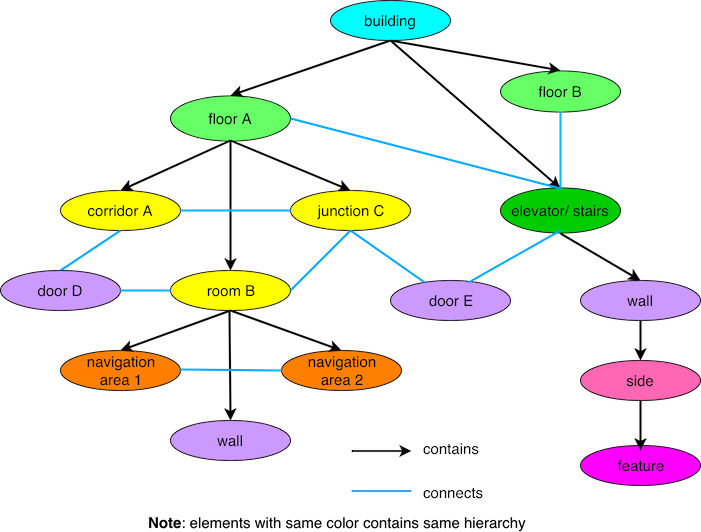

# OSM bridge

## Installation

```

To install OBL run the following command:
```
sudo pip3 install -e . --process-dependency-links
```

To run all unit tests:
```
python3 -m unittest discover -s 'tests' -p '*_test.py'
```

## Overall package architecture

#### OSM adapter
* Provides python interface for making queries to overpass API
* Provides method to query using OSM unique id as well based on OSM tags
* More complex queries can also be made by directly passing overpass query

Methods
```
- OSMAdapter(server_ip=, server_port=): constructor
  - server_ip : overpass server ip
  - server_port : overpass server port

- test_overpass_connection() - to check if overpass connection was successful

- get_osm_element_by_id(ids, data_type, role, role_type) : to find OSM element by id/s
  - ids : array containing OSM ids
  - data_type : node/way/relation
  - role : to query specific member of relation (optional)
  - role_type : data type of relation member with specified role (optional)

- search_by_tag(data_type, key, value, scope_id=, scope_role=, scope_role_type=): search OSM element by tag 
  - data_type : node/way/relation
  - key : key to identify tag
  - value : value of tag
  - scope_id : reduces the search scope to specified relation members (optional)
  - scope_role : relation member role where search should be performed (optional)
  - scope_role_type : data type of relation member with specified role (optional)

- get(raw_overpass_query) : can be used to make raw overpass queries
```

#### OSM bridge
* Provides abstraction to world model (https://git.ropod.org/ropod/wm/openstreetmap-indoor-modelling) using OSM adapter
* Provides methods to query different world model entities based on their `uuid` (OSM) or by their `semantic` names

Methods
```
- OSMBridge(server_ip=, server_port=, global_origin=, local_origin=, cooridnate_system=): constructor
  - server_ip : overpass server ip
  - server_port : overpass server port
  - global_origin : global origin in lat,lng ([lat,lng])
  - local_origin : local origin in x,y ([x,y])
  - coordinate_system : spherical / cartesian

- set_cooridnate_system(name, global_origin=, local_origin=) : setter for coordinate system related settings

- get_feature(ref) : returns Feature given semantic ref or OSM uuid

- get_side(ref) : returns Side given semantic ref or OSM uuid

- get_door(ref) : returns Door given semantic ref or OSM uuid

- get_wall(ref) : returns Wall given semantic ref or OSM uuid

- get_local_area(ref) : returns LocalArea given semantic ref or OSM uuid

- get_connection(ref) : returns Connection given semantic ref or OSM uuid

- get_room(ref) : returns Room given semantic ref or OSM uuid

- get_corridor(ref) : returns Corridor given semantic ref or OSM uuid

- get_elevator(ref) : returns Elevator given semantic ref or OSM uuid

- get_stairs(ref) : returns Stairs given semantic ref or OSM uuid

- get_floor(ref) : returns Floor given semantic ref or OSM uuid

- get_building(ref) : returns Building given semantic ref or OSM uuid
```


## WM entities

### Overall hierarchy



### Geometry

#### Point
Attributes
```
- id
- coordinate_system
- lat
- lon
- x
- y
```

#### Shape
Attributes
```
- points 
```

### World model entities

#### Building
Attributes
```
- id
- building 
- name
- city
- country
- height
- min_level
- max_level
- non_existant_levels
- color
- material
```
Methods
```
- floors : returns all the floors part of the building
- elevators : returns all the elevators part of the building
- stairs : returns all the stairs part of the building
- geometry : returns geometry of the building
- floor(ref) : returns specific floor of building based on its semantic ref 
- elevator(ref) : returns specific elevator of building based on its semantic ref
- stair(ref) : returns specific stair of building based on its semantic ref
```

#### Floor
Attributes
```
- id
- ref
- name
- height
```
Methods
```
- walls : returns walls present on the floor but not part of any room or corridor
-  connections : returns all the global connection on given floor (connections between rooms, corridors and doors)
- rooms : returns all the rooms present on given floor
- corridors : returns all the corridors present on given floor
- room(ref) : returns specific room on floor based on its semantic ref
- corridor(ref): returns specific corridor on floor based on its semantic ref
```
#### Connection
Attributes
```
- id
- highway : 
  - localway : connects local areas
  - footway: connects rooms, corridors, doors etc.
- oneway
- lanes_forward
- lanes_backward
- lanes_forward_speed
- lanes_backward_speed
```
Method
```
- points : returns all the points part of the connections
```

#### Elevator
Attributes
```
- id
- levels
- ref
```
Methods
```
- geometry : returns geometry of the elevator
- topology : returns topological node corresponding to the given elevator
- walls : returns all the walls part of the elevator
- doors : returns all the doors part of the elevator
- features : returns any feature part of the elevator such as ceiling lights
- connections : returns all the connections between local areas part of elevator as well as entry and exit connections to elevator on each floor
- local_areas : returns all local areas part of the elevator
- local_area(ref) : returns specific local area part of elevator based on its semantic name
```

#### Stairs
Attributes
```
- id
- levels
- conveying
- stair_height
- stair_width
- stair_length
```
Methods
```
- geometry : returns geometry of the room/area containing stairs
- topology : returns topological node corresponding to the given stairs
- walls : returns walls part of the stairs room
- doors : returns doors part of the stairs room
- features : returns any features part of stairs room such as ceiling lights
- connections : returns all the connections between local areas part of stairs room/area as well as entry and exit connections to it
- local_areas : returns all local areas part of the stairs room/area
- local_area(ref) : returns specific local area part of the stairs room/area based on its semantic name
```

#### Room
Attributes
```
- id
- amenity
- ref
- name
- surface
- surface_smoothness
- internet
- level
```
Methods
```
- geometry : returns geometry of the room
- topology : returns topological node corresponding to the given room
- walls : returns walls part of the room
- doors : returns doors part of the room
- features : returns any features part of the room such as ceiling lights
- connections : returns all the connections between local areas part of room as well as entry and exit connections to it
- local_areas : returns all local areas part of the room
- local_area(ref) : returns specific local area part of the stairs room based on its semantic name
```

#### Corridor
Attributes
```
- ref
- name
- surface
- surface_smoothness
- internet
- level
```
Methods
```
- geometry : returns geometry of the corridor
- topology : returns topological node corresponding to the given corridor
- walls : returns walls part of the corridor
- doors : returns doors part of the corridor
- features : returns any features part of the corridor such as ceiling lights
- connections : returns all the connections between local areas part of corridor as well as entry and exit connections to it
- local_areas : returns all local areas part of the corridor
- local_area(ref) : returns specific local area part of the stairs corridor based on its semantic name
```

#### Area (eg. Lobby, foyer etc.)
Attributes
```
- id
- ref
- name
- surface
- surface_smoothness
- internet
- level
```
Methods
```
- geometry : returns geometry of the area
- topology : returns topological node corresponding to the given area
- walls : returns walls part of the area
- doors : returns doors part of the area
- features : returns any features part of the area such as ceiling lights
- connections : returns all the connections between local areas part of area as well as entry and exit connections to it
- local_areas : returns all local areas part of the area
- local_area(ref) : returns specific local area part of the stairs area based on its semantic name
```

#### Local Area
Attributes
```
- id
- behaviour
- ref
```
Methods
```
- geometry : returns geometry of the local area
- topology : returns topological node corresponding to the given local area
```

#### Wall
Attributes
```
- id
- height
- min_height
- level
```
Methods
```
- geometry : returns 2D shape of the wall
- sides : returns all the sides of the wall
```

#### Door
Attributes
```
- id
- door
- door_automatic
- door_direction
- step_count
- double_doors
- always_closed
- level
```
Methods
```
- geometry : retuns 2D shape of the wall
- topology : returns topological node corresponding to the door
- sides : returns all the sides of the wall
```

#### Door/Wall side
Attributes
```
- id
- texture
- paint
(additional attributes possible)
```
Methods
```
- corners : returns 2 corner points of the wall/door side. These can be used to identify which side of the wall or door. 
- features : returns any features present on side such as fire extinguishers
```

#### Feature
Attributes
```
- id
- height
- width
- length
(additional attributes possible)
```

## Note
* All the attributes maynot be available immediately once any `wm_entity` is initialised as different attributes are stored under different models in OSM. Most of the attributes will be available after loading geometry (if exist). 
* Querying each model requires atleast 1 overpass query, which can be time consuming as well as unnecessary most of thr times hence all the models are not loaded during initialisation


#### Path planner
Methods
```
- set_building(building ref) - to set building 
- set_cooridnate_system('spherical'/'cartesian') - to set cooridnate system
- get_path_plan(start floor ref,destination floor ref, start area ref, destination area ref)
  Available keyword arguments:
    - start_local_area: start local area ref
    - destination_local_area: destination local area ref
    - destination_task: task to be performed at destination
    - robot_position: robot starting position
    (2 of these 4 keyworkd arguments must be passed - 1 each for start and destination)
- get_estimated_path_distance(start floor ref, destination floor ref, start area ref, destination area ref) - returns estimated path distance in m
```

